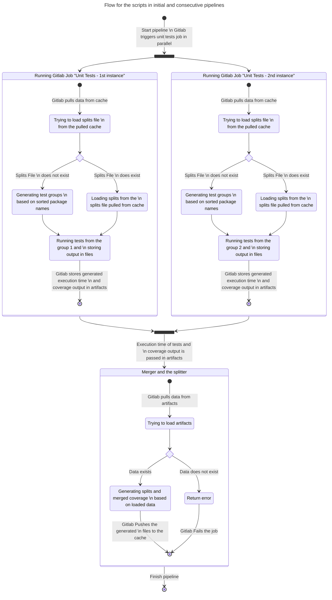

# Gitlab Integration

There are two ways to integrate.

## Simple approach

Each branch generates the split file during the first pipeline.
Following pipelines use the cached version of the split file.

```yaml
stages:
  - tests

unit_tests:
  stage: tests
  parallel: 2
  script:
    # Gitlab Env variables are detected automatically. That's why
    # there is no need to pass them explicitly by params such as:
    # --split-index=$CI_NODE_INDEX
    # --split-total=$CI_NODE_TOTAL
    - golangci-test test --split-file=.golangci-test-splits.json --fallback=even
  cache:
    policy: pull
  artifacts:
    key: "$CI_COMMIT_REF_NAME"
    paths:
      - test_out_*.json
      - coverage_*.txt

unit_tests_merger:
  stage: tests
  needs: [ "unit_tests" ]
  script:
    # In the following, lines, asterisk is used as a wildcard. 
    # It's a not feature of golangci-test, 
    # but a feature called globbing implemented by most shells. 
    # Read more here: https://tldp.org/LDP/abs/html/globbingref.html 
    - golangci-test split --output=.golangci-test-splits.json --merge ./test_out_*.json
    - golangci-test covmerge ./coverage_*.out > coverage.out
    # TODO: is `out` the standard extension for coverage? :D
  artifacts:
    paths:
      - coverage.txt
  cache:
    policy: push
    paths:
      - .golangci-test-splits.json
```

Pipeline defined in the above *yaml* file will generate pipeline as
shown in the diagram below.




